# Online Store API — Assignment 4

## Overview
This project is a RESTful backend API for an online store developed using Node.js, Express, and MongoDB.  
The purpose of this assignment is to demonstrate proper backend architecture, authentication, and security practices.

The application implements:
- MVC (Model–View–Controller) architecture
- Authentication with JWT (JSON Web Tokens)
- Password hashing using bcrypt
- Role-Based Access Control (RBAC)
- Multi-object CRUD operations
- API testing using Thunder Client

---

## Project Structure (MVC)

├── server.js
├── models/
│ ├── User.js
│ ├── Product.js
│ ├── Review.js
│ └── Order.js
├── controllers/
│ ├── authController.js
│ ├── productController.js
│ ├── reviewController.js
│ └── orderController.js
├── routes/
│ ├── authRoutes.js
│ ├── productRoutes.js
│ ├── reviewRoutes.js
│ └── orderRoutes.js
├── middleware/
│ ├── auth.js
│ ├── roles.js
│ ├── validation.js
│ └── error.js
└── res/
├── s0.png
├── s1.png
├── ...
└── s15.png


---

## Data Models

### User
Used only for authentication and authorization.

Fields:
- email
- password (hashed using bcrypt)
- role (user / admin)

---

### Product (Primary Object)
Represents products available in the store.

Fields:
- name
- description
- category
- price

---

### Review (Secondary Object)
Represents reviews related to products.

Fields:
- productId
- username
- rating
- comment

---

### Order (Additional Business Object)
Represents a purchase made by a user.

Fields:
- user
- items
- totalPrice
- status

---

## Authentication & Security
- Passwords are hashed using bcrypt
- Authentication is handled via JWT
- Tokens are sent using the HTTP header:

Authorization: Bearer <token>


---

## Role-Based Access Control (RBAC)

| Role  | GET | POST | PUT | DELETE |
|------|-----|------|-----|--------|
| user | ✅  | ❌   | ❌  | ❌     |
| admin| ✅  | ✅   | ✅  | ✅     |

Rules:
- GET requests are public
- POST, PUT, DELETE requests are restricted to admin users
- Orders can be created by any authenticated user
- Users can view only their own orders
- Admins can view all orders

---

## API Endpoints

### Authentication
- POST /auth/register
- POST /auth/login

### Products
- GET /products
- GET /products/:id
- POST /products (admin only)
- PUT /products/:id (admin only)
- DELETE /products/:id (admin only)

### Reviews
- GET /reviews
- POST /reviews (admin only)

### Orders
- POST /orders (authenticated users)
- GET /orders/my (user only)
- GET /orders (admin only)

---

## API Testing (Thunder Client)

All endpoints were tested using Thunder Client.  
Screenshots are stored in the `res/` folder and demonstrate authentication, authorization, and CRUD behavior.

Test sequence:
- 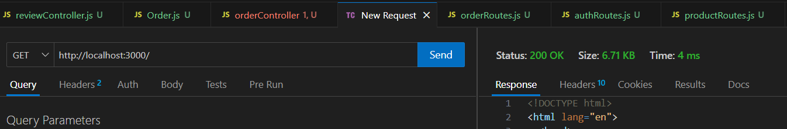 — Server running
- 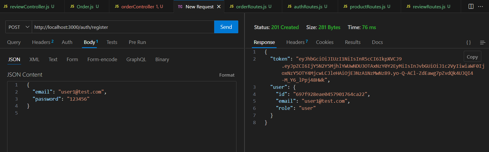 — User registration
- 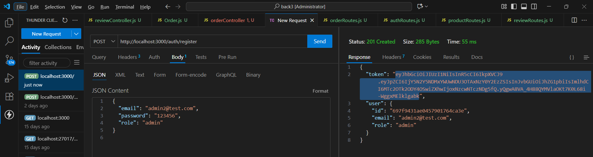— Admin registration
- 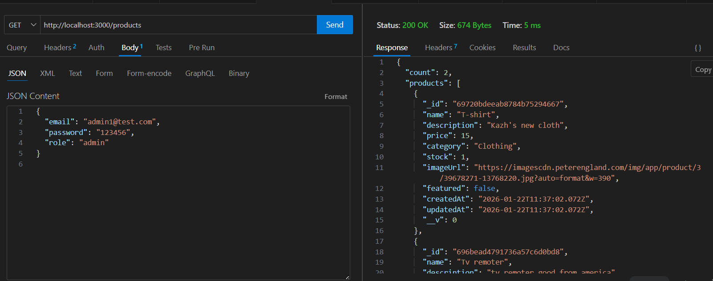 — Public GET products
- 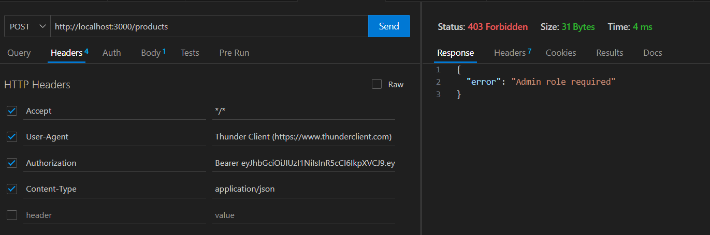 — User forbidden to create product (403)
- 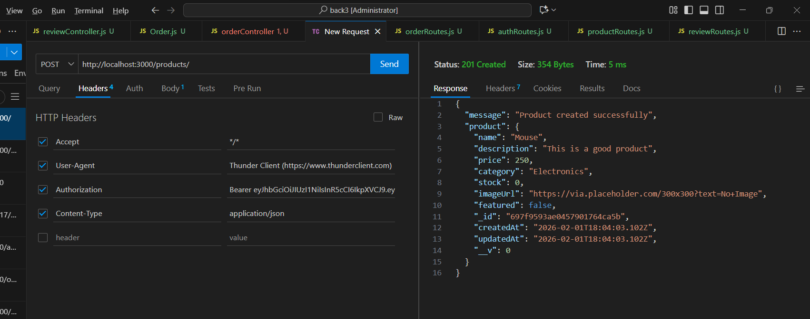 — Admin creates product
- 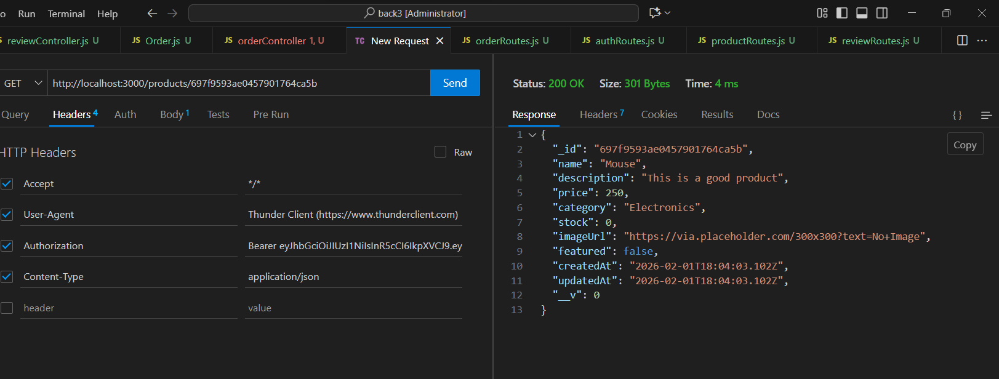 — Public GET product by ID
- 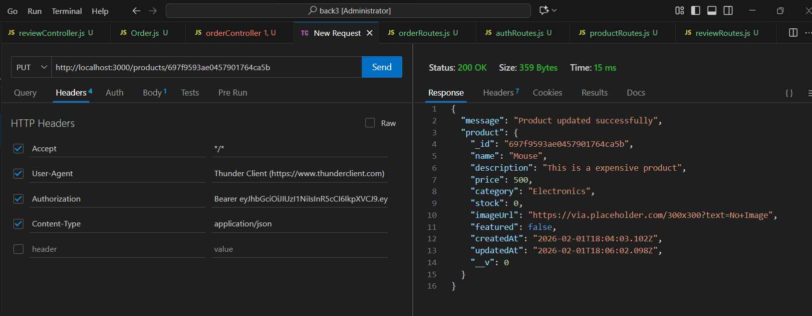 — Admin updates product
- 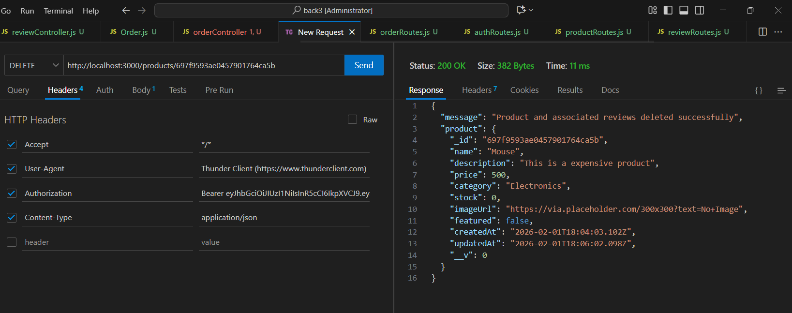 — Admin deletes product
- 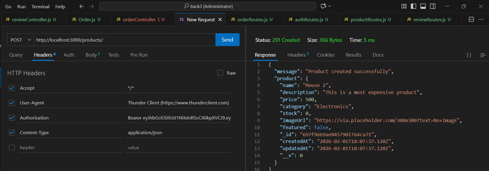 — User forbidden to create review
- 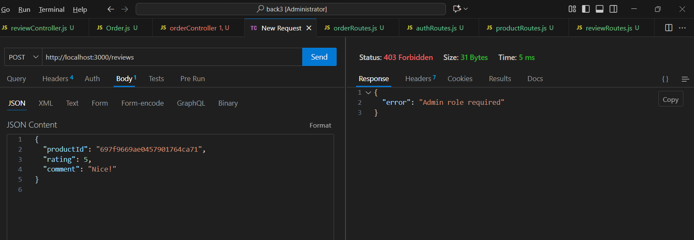 — Admin creates review
- 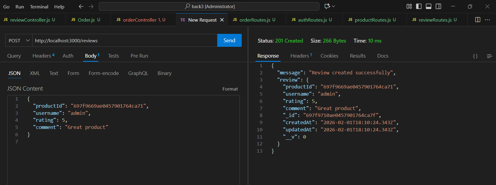 — Public GET reviews
- 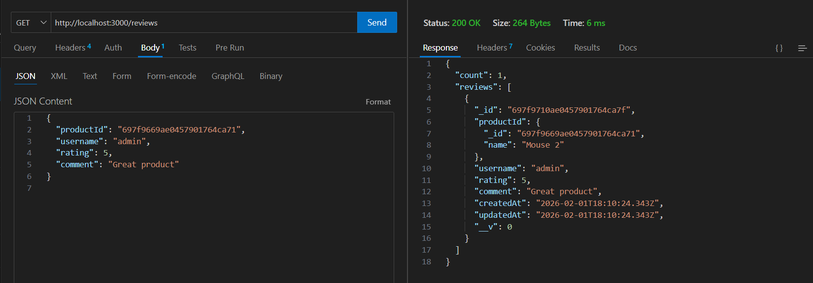 — User creates order
- 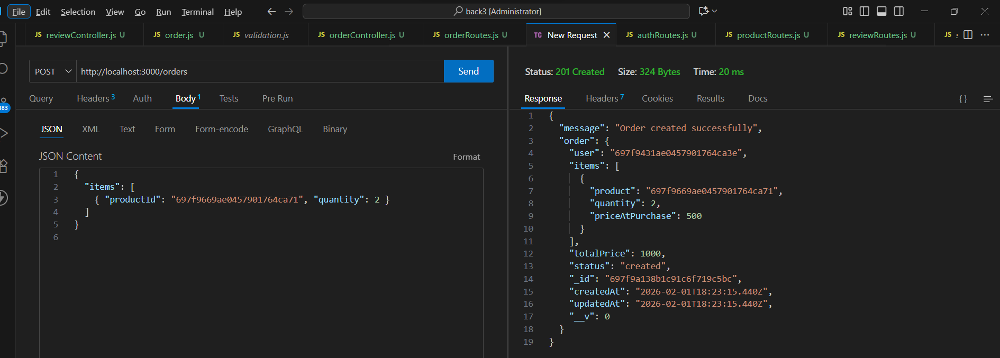 — User views own orders
- 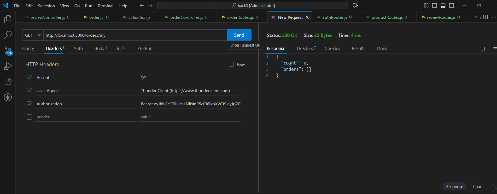 — Admin views all orders
- 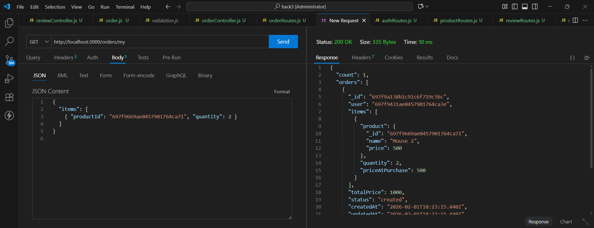 — RBAC validation confirmation

---

## How to Run the Project

1. Install dependencies:
```bash
npm install
Create a .env file:

PORT=3000
MONGODB_URI=mongodb://127.0.0.1:27017/online-store
JWT_SECRET=veryLongSecret
JWT_EXPIRES_IN=7d
Start the server:

npm start
Conclusion
This project demonstrates a secure and scalable backend system following modern best practices.
It includes clean MVC architecture, authentication with JWT, role-based authorization, and documented API testing results.

The application can be extended further with features such as payments or a shopping cart.
